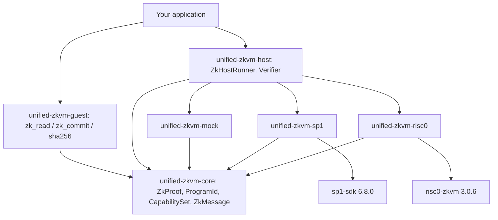

# unified-zkvm

**Write your zkVM application once. Choose the proving backend later.**

`SP1 · RISC Zero · Mock`

[](https://github.com/AminMemariani/unified-zkvm/actions/workflows/ci.yml)
[](https://crates.io/crates/unified-zkvm)
[](https://docs.rs/unified-zkvm)
[](#license)


A portable Rust abstraction over zkVM proving systems. Your guest program reads
inputs and commits public values through one API; your host proves and verifies
through one API. The backend becomes a dependency choice instead of a rewrite.

> **Status:** pre-1.0. The mock backend is stable. The SP1 and RISC Zero
> adapters compile against their pinned SDKs and their unit tests pass, but
> end-to-end proving requires the vendor toolchain and is exercised by
> `#[ignore]`d tests and scheduled CI - not by `cargo test --workspace`. See
> [Honest limitations](#honest-limitations).

## Hero example

The guest - no backend-specific code anywhere in it:

```rust
#![cfg_attr(any(feature = "sp1", feature = "risc0"), no_main)]

use unified_zkvm::guest::{zk_commit, zk_read};

#[unified_zkvm::entrypoint]
fn main() {
    let n: u32 = zk_read().expect("input");
    let (mut a, mut b) = (0u64, 1u64);
    for _ in 0..n {
        let next = a + b;
        a = b;
        b = next;
    }
    zk_commit(&a).expect("commit");
}
```

The host - prove, verify, and only then read the output:

```rust
use unified_zkvm::host::{RunnerConfig, ZkHostRunner};
use unified_zkvm::mock::MockBackend;

fn main() -> Result<(), unified_zkvm::ZkVmError> {
    let backend = MockBackend::new();
    let program = backend.build_program(b"guest-elf-bytes")?;

    let runner = ZkHostRunner::builder()
        .backend(backend)
        .config(RunnerConfig::development())
        .build()?;

    let (proof, verified) = runner.prove_and_verify(&program, &10u32)?;

    // `verified` exists only because verification succeeded.
    let value: u64 = verified.decode()?;
    println!("fib(10) = {value}  ({} proof bytes)", proof.size_bytes());
    Ok(())
}
```

Swapping `MockBackend` for `Sp1Backend` or `Risc0Backend` changes those two
lines and nothing else. What it does *not* change is described honestly below.

## Architecture



Dependencies point one way: adapters depend on core, core depends on nobody.
Details in [docs/architecture.md](https://github.com/AminMemariani/unified-zkvm/blob/main/docs/architecture.md).

## Why not just use an SDK directly?

Using a vendor SDK directly is a perfectly good choice, and every backend here
is a serious piece of engineering. The cost shows up later:

- **Vendor lock-in by diffusion.** Backend types leak into application code one
  import at a time until switching means touching every file.
- **Duplicated host code.** Setup, proving, verification, artifact persistence
  and error mapping get rewritten per SDK.
- **Duplicated serialization.** Each SDK has its own input/commit convention;
  agreeing on bytes between host and guest is solved once here.
- **Different proof representations.** Storing, shipping and routing proofs from
  two backends needs a shared envelope - otherwise you invent one anyway.
- **Hard to evaluate.** Comparing backends on *your* workload requires two
  implementations, so most teams never measure and pick by reputation.

unified-zkvm makes the portable part portable and names the rest.

## Backend maturity

| Backend | Status | Execute | Prove | Verify | Notes |
|---|---|---|---|---|---|
| Mock | stable | yes | yes - **not a proof** | yes | development only; no cryptography |
| SP1 | supported | yes | yes | yes | adapter compiles against `sp1-sdk 6.8.0`; unit tests pass; end-to-end proving needs `sp1up` |
| RISC Zero | supported | yes | yes | yes | adapter compiles against `risc0-zkvm 3.0.6`; unit tests pass; end-to-end proving needs `rzup` |
| OpenVM | planned | - | - | - | no adapter; upstream `2.0.2`, MSRV 1.91.1 |
| Jolt | planned | - | - | - | no adapter; git-only, alpha; upstream states it is not suitable for production |
| Pico | planned | - | - | - | no adapter; git-only (the crates.io name `pico-sdk` is an unrelated oscilloscope driver) |

Full matrix, pinned versions and prerequisites:
[docs/backend-compatibility.md](https://github.com/AminMemariani/unified-zkvm/blob/main/docs/backend-compatibility.md).

## Install

```toml
[dependencies]
unified-zkvm = "0.1"
```

The default features give you the host API and the mock backend, so the crate is
usable with no proving SDK installed. Backend adapters are separate crates
outside the default workspace because each pulls a multi-hundred-crate SDK:

```toml
unified-zkvm-sp1 = "0.1"     # requires `protoc` on the host
unified-zkvm-risc0 = "0.1"   # on macOS may need RISC0_SKIP_BUILD_KERNELS=1
```

### Features

| Feature | Default | Effect |
|---|---|---|
| `std` | yes | `std::error::Error` impls, filesystem proof save/load |
| `host` | yes | `ZkHostRunner`, `Verifier`, proving and verification |
| `mock` | yes | development backend (implies `host`) |
| `guest` | no | `zk_read` / `zk_commit` / `sha256`; enable inside a guest crate |
| `macros` | no | the `#[entrypoint]` attribute |
| `sp1` | no | selects the SP1 guest runtime |
| `risc0` | no | selects the RISC Zero guest runtime |

Exactly one guest runtime may be selected. With none, the guest compiles against
a host-test runtime - which is what makes guest logic unit-testable with plain
`cargo test`.

## Honest limitations

"Write once, run on any zkVM" means *writing against the portable abstraction*.
It does not mean every guest runs unchanged everywhere.

- **Precompiles differ.** Accelerated SHA-256, Keccak and curve operations are
  backend-specific and are selected in the guest manifest's
  `[patch.crates-io]`. No adapter here currently claims any `*_ACCEL`
  capability, because none has been verified end to end. `keccak256()` returns
  `UnsupportedCapability` rather than silently proving an expensive software
  implementation. See [docs/crypto.md](https://github.com/AminMemariani/unified-zkvm/blob/main/docs/crypto.md).
- **Proof formats are not interchangeable.** A proof is a backend-native
  artifact. unified-zkvm gives it a common envelope; it does not make an SP1
  proof verifiable by RISC Zero.
- **Toolchains are not portable.** Building a guest ELF requires the vendor
  toolchain (`sp1up`, `rzup`). Neither is installed by rustup.
- **Performance is not portable.** Cycle counts, proving time and proof sizes
  differ substantially between backends and between workloads. Nothing here
  normalizes that, and no benchmark numbers are published yet.
- **Aggregation is unavailable.** Neither pinned SDK exposes a host-level
  `aggregate(&[proof]) -> proof`. `aggregate()` returns
  `UnsupportedCapability`. See [docs/aggregation.md](https://github.com/AminMemariani/unified-zkvm/blob/main/docs/aggregation.md).
- **The abstraction can lag upstream.** Adapters pin exact SDK versions; a new
  upstream feature is unavailable until an adapter implements and tests it.

## Security

Verification binds three things together: the proof, the program identity, and
the public values. `ZkHostRunner::verify` checks backend match, then program-ID
match, then runs the backend's real cryptographic verifier - in that order. Only
on success do you get a `VerifiedPublicValues`, which is the sole safe way to
read a guest's output. Reading unverified values requires the deliberately
verbose `PublicValues::decode_unverified`.

Defaults are the safe ones: no silent proof-kind downgrade
(`FallbackPolicy::Deny`), and telemetry never logs guest input - the private
witness - or public values unless explicitly enabled.

**unified-zkvm is an abstraction layer. It does not independently make an
underlying zkVM cryptographically secure.** Full threat model:
[docs/security-model.md](https://github.com/AminMemariani/unified-zkvm/blob/main/docs/security-model.md).

## Testing

The whole workspace tests with no zkVM installed:

```bash
cargo test --workspace
```

That runs 168 tests: unit tests across core, guest, host and mock; cross-backend
portability tests against a native reference model; negative-security tests
(tampered proofs, wrong program identity, hostile length prefixes); property-based
serialization tests; `compile_fail` tests proving you cannot claim a proof is
verified without verifying it; and golden vectors that pin the exact wire bytes.

Backend adapters live outside the default workspace and are checked separately - 
see [CONTRIBUTING.md](https://github.com/AminMemariani/unified-zkvm/blob/main/CONTRIBUTING.md). Their end-to-end proving tests are
`#[ignore]`d because they need the vendor toolchains (`sp1up`, `rzup`).

## Built with unified-zkvm

Nothing to list yet. If you ship something with it, open a PR adding your
project here - an empty list beats a fictional one.

## Contributing

See [CONTRIBUTING.md](https://github.com/AminMemariani/unified-zkvm/blob/main/CONTRIBUTING.md), [GOVERNANCE.md](GOVERNANCE.md) and
[CODE_OF_CONDUCT.md](CODE_OF_CONDUCT.md). Adding a backend has its own contract:
[docs/adding-a-backend.md](https://github.com/AminMemariani/unified-zkvm/blob/main/docs/adding-a-backend.md). Security issues go through
[SECURITY.md](https://github.com/AminMemariani/unified-zkvm/blob/main/SECURITY.md) - privately, first.

## License

MIT OR Apache-2.0, at your option.
