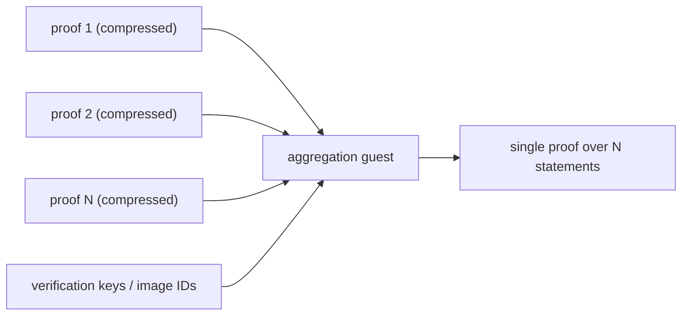

# Aggregation

**Short answer:** `aggregate()` returns `UnsupportedCapability` on every shipped
backend, and that is the honest result rather than a gap someone forgot to fill.

## Four words that are not synonyms

These terms get used interchangeably and mean very different things:

| Term | Meaning | Result |
|---|---|---|
| **Batching** | proving several computations in one guest run | one proof, one program |
| **Compression** | recursively shrinking one proof | one proof, constant size |
| **Recursion** | verifying a proof inside a guest | a building block, not a product |
| **Aggregation** | one proof attesting to *N independent* proofs | one proof, N programs |
| **Composition** | a proof that consumes another proof's output as an assumption | a dependency chain |

Only *aggregation* is what `ProofAggregator` promises. Putting several proofs in
a `Vec` is batching at best - offering it under an aggregation name would let a
caller believe they had constant-size verification when they had linear-size
verification. That mistake is invisible until the on-chain gas bill arrives.

**Compression is supported.** Both real adapters set
`CapabilitySet::COMPRESSION` and can produce `ProofKind::Compressed` (SP1
`Compressed`, RISC Zero `Succinct`). If your goal is "smaller proof", that is
the feature you want, and it exists today.

## The contract

```rust
pub trait ProofAggregator {
    fn aggregate(&self, proofs: &[ZkProof]) -> Result<ZkProof, ZkVmError>;
    fn supports_aggregation(&self) -> bool;
}
```

An implementation must produce a proof whose verification **genuinely implies
the validity of every input proof**. Concatenation, wrapping in a container, or
any construction whose verification cost grows with `proofs.len()` does not
satisfy this and must not be offered here.

The blanket impl over `BackendAdapter` enforces three things before any backend
work: the `AGGREGATION` capability must be set, `proofs` must be non-empty, and
every proof's backend must match the adapter's. Mixing backends is meaningless - 
no verifier can check both halves.

## Why no backend implements it

Research against the pinned SDKs found that **neither SP1 6.8.0 nor RISC Zero
3.0.6 exposes a host-level `aggregate(&[proof]) -> proof`.** Both provide the
*ingredients*:

| Backend | Ingredients |
|---|---|
| SP1 | in-guest `verify_sp1_proof`, plus `SP1Stdin::write_proof` on the host. Input proofs must be **compressed**. |
| RISC Zero | host-side `env::add_assumption`, plus in-guest `env::verify` |

Assembling them requires **a dedicated aggregation guest program, compiled for
the specific set of proofs being folded** - it must know the verification keys /
image IDs it is folding and what the aggregated public values mean. That program
is application-specific, so a *generic* adapter cannot supply it. An adapter
that tried would have to invent an application's semantics, and would get them
wrong.

Hence: `CapabilitySet::AGGREGATION` is unset everywhere, `aggregate()` fails
with `UnsupportedCapability`, and this page tells you how to do it yourself.

## Building your own aggregation guest

The abstraction does not block you; it just does not pretend to do this for you.
Use the escape hatch (`runner.backend()`, see
[host-guide.md](host-guide.md#the-escape-hatch)) and work against the SDK
directly.



Sketch of the work, SP1 flavour:

1. Prove each leaf with `ProofKind::Compressed` - SP1's in-guest verification
   requires compressed input proofs.
2. Write an aggregation guest that calls `verify_sp1_proof` once per leaf,
   checks the leaves' public values against whatever your application requires,
   and commits an aggregated public value.
3. On the host, feed each leaf proof with `SP1Stdin::write_proof` and prove the
   aggregation guest.

RISC Zero flavour: add each leaf receipt as an assumption with
`env::add_assumption`, call `env::verify` in the aggregation guest, and let the
resolve step discharge the assumptions.

Then wrap the result back into a `ZkProof` via `ZkProof::new(...)` with
`ProofKind::Aggregated` so the rest of your system - container persistence,
verification binding, telemetry - keeps working normally.

**Do not** set `CapabilitySet::AGGREGATION` on a general-purpose adapter to make
this work. If you build an aggregation-specific adapter for your application,
setting the bit on *that* adapter is correct, because there the claim is true.

## What would change this page

An upstream SDK gaining a generic host-level aggregation entry point, or this
project shipping an application-neutral aggregation guest with tests that prove
the folded proof actually implies its leaves. Both are on
[../ROADMAP.md](../ROADMAP.md) as future work, neither is done.

## Related

- [backend-compatibility.md](backend-compatibility.md)
- [host-guide.md](host-guide.md)
- [adr/ADR-005-capability-system.md](adr/ADR-005-capability-system.md)
