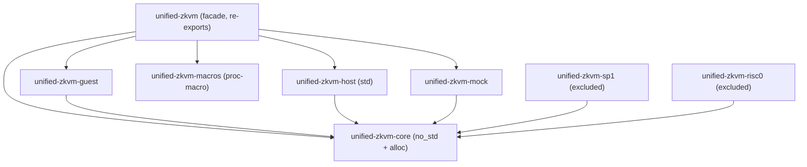
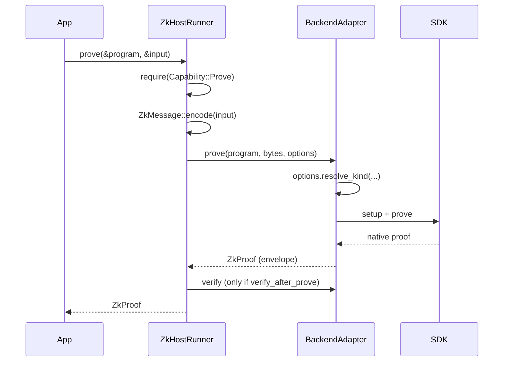

# Architecture

## The shape of the problem

A zkVM application has three parts that change at different rates: the guest
computation (yours, stable), the host orchestration (mostly boilerplate), and
the proving system (vendor code, moving fast). Mixing them means the fast-moving
part dictates the structure of the slow-moving part. The crate split exists to
keep that from happening.

## Crate graph

| Crate | Role | Depends on |
|---|---|---|
| `unified-zkvm-core` | backend-neutral types: `BackendId`, `CapabilitySet`, `ZkProof`, `ProgramId`, `ZkMessage`, `PublicValues`, `ZkVmError`, container format | `serde`, `postcard`, `bitflags`, `sha2` |
| `unified-zkvm-guest` | guest-side I/O and crypto: `zk_read`, `zk_commit`, `sha256` | core, `serde`, `postcard` |
| `unified-zkvm-host` | `ZkHostRunner`, `Verifier`, `Prover`, `ProofAggregator`, config | core, `tracing` |
| `unified-zkvm-macros` | the single `#[entrypoint]` attribute | `syn`, `quote` |
| `unified-zkvm-mock` | development backend, no cryptography | core |
| `unified-zkvm` | facade with feature-gated re-exports | all of the above |
| `unified-zkvm-sp1` / `-risc0` | real adapters | core + vendor SDK |

## Dependency direction

**Everything points at core; core points at nobody.** Core has four
dependencies and no knowledge of any backend. Adapters know about core and about
their own SDK. Core never knows about adapters.

The practical consequence: adding a backend cannot change core's API, and
core can be audited without reading a proving SDK. `BackendId` does enumerate
planned backends (`Jolt`, `OpenVm`, `Pico`) - that is a *name and stable
discriminant* reservation, not a dependency. `BackendId::integration_status()`
reports what is actually implemented.

## Why the workspace is split this way

**Guest crates pay for every byte.** A guest program's dependency tree becomes
proving cycles. `unified-zkvm-guest` is therefore deliberately free of
host-side machinery - no async runtime, no HTTP client, no filesystem client - 
and its manifest carries a comment saying exactly that. If host and guest shared
one crate, guests would link host code.

**Core must be `no_std`.** Guests run without an operating system. Core is
`no_std + alloc` with an opt-in `std` feature that adds `std::error::Error`
impls and filesystem proof save/load. Keeping proof and message types in a
`no_std` crate means the same type describes a proof on both sides.

**Adapters are full workspace members.** `unified-zkvm-sp1` and
`unified-zkvm-risc0` are covered by `cargo test --workspace`, so an API change
in core that breaks an adapter fails immediately rather than days later in a
scheduled job. That matters for a project whose whole value is a stable
abstraction: the adapters are the only real proof that the abstraction fits
more than one backend.

The cost is a slow first build, since both proving SDKs compile, and one host
prerequisite (`protoc`, for SP1). Contributors working purely on the
abstraction can sidestep both by selecting crates with `-p`, which is documented
in [CONTRIBUTING.md](../CONTRIBUTING.md).

Isolation still holds where it counts. Each adapter is its own crate with its
own dependency tree, so a downstream user enabling SP1 never compiles RISC Zero,
and upgrading one SDK cannot disturb the other. Membership is about *our* test
coverage; crate separation is about *their* build cost. Notably, both SDKs
coexist in one dependency graph without a feature-unification conflict, which is
itself worth knowing.

**Macros are separate because proc-macro crates must be.** It is also a
deliberately small crate: exactly one macro, which earns its place by hiding a
genuine portability problem (each zkVM has a different entrypoint ritual).
Anything else it could generate is better as an ordinary function, which
produces better error messages.

## Control flow of a proving run

Note the ordering the runner enforces before any backend work happens:
capability gate, then canonical encoding. And on the verify path: backend match,
program-identity match, then cryptography. See
[security-model.md](security-model.md).

## Static and dynamic dispatch

`ZkHostRunner<B>` is generic over `B: BackendAdapter`, so the default path is
monomorphized with no vtable. For applications that choose a backend at runtime,
`core::backend::DynBackend` is `Box<dyn BackendAdapter>`, and there is a
blanket `BackendAdapter` impl for the boxed form so `ZkHostRunner<DynBackend>`
works unchanged. Rationale in [adr/ADR-007-backend-selection.md](adr/ADR-007-backend-selection.md).

## Tests as a crate

`tests/` is a workspace member, not a pile of `#[test]` files, because the
portability harness and the example guests must share *one* reference
implementation. Its `[lib]` is named `uzkvm_test_support` and points at
`portability/reference.rs`: comparing a backend against a copy of the reference
would defeat the purpose of a differential test.

## Related

- [backend-compatibility.md](backend-compatibility.md) - per-backend truth
- [guest-guide.md](guest-guide.md) / [host-guide.md](host-guide.md)
- [adr/](adr/) - the decisions and their negative consequences
