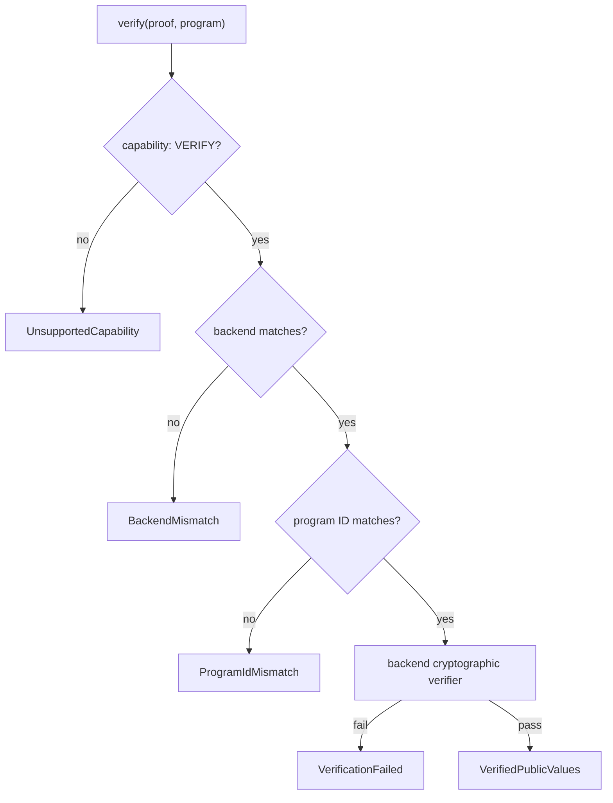
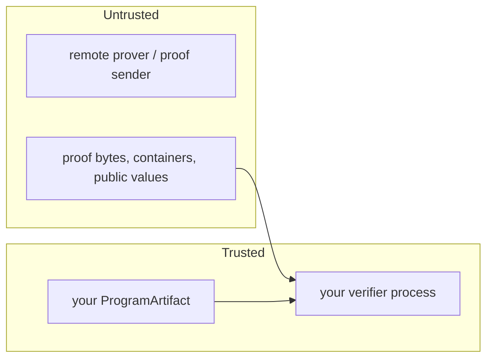

# Security model

**unified-zkvm is an abstraction layer. It does not independently make an
underlying zkVM cryptographically secure.** Soundness comes from the backend.
What this project contributes is that the backend's guarantee is not thrown away
by the plumbing around it.

## What a proof actually proves

A verified proof says: *this specific program, run on some input, produced these
public values.* Three bindings must all hold, or the sentence loses its meaning:

| Binding | Enforced by |
|---|---|
| proof <-> backend | `ZkProof::verify_binding` - backend match |
| proof <-> program identity | `ZkProof::verify_binding` - program-ID match |
| proof <-> public values | the backend's cryptographic verifier |

## Verification order



The cheap structural checks run **before** the expensive cryptographic one. That
is not only performance: it means a cross-backend proof is refused before any
crypto runs, so a weak-backend artifact never gets a chance to interact with a
strong verifier's decoder.

The `verify` signature requires the program. There is deliberately **no**
`verify(&proof)` overload that infers identity from the proof - that would check
a proof against whatever program the proof claims, which is no check at all.

## The type system as a guardrail

`VerifiedPublicValues` is constructible only via `ZkProof::into_verified()`,
which **requires a `VerificationWitness`**. That witness is a zero-sized
capability token minted by `VerificationWitness::new`, which in turn demands a
type implementing the *sealed* `VerifierIdentity` trait. Only backend adapters
inside this workspace implement it, so application code cannot manufacture one.

The practical consequence: `BackendAdapter::verify` returns the witness on its
success path, after `verify_binding` and the cryptographic verifier have both
passed. There is no expressible way to obtain trusted public values without a
verifier having accepted the proof - this is enforced by the compiler, not by
convention. Both of these fail to compile:

```rust,compile_fail
let trusted = proof.into_verified();              // no witness available
```

```rust,compile_fail
struct IAmNotAVerifier;
let forged = VerificationWitness::new(&IAmNotAVerifier);  // trait is sealed
```

Unverified access still exists - `PublicValues::decode_unverified` - and is
deliberately verbose so it stands out in review. It is the right tool for
inspecting the output of a local `execute()` run, which was never proven at all.

## Trust boundaries



- **The private witness (guest input) is trusted by nobody but its owner.** It
  never leaves the prover. Telemetry never logs it by default - 
  `TelemetryConfig::log_guest_input` is `false` and should stay that way outside
  local debugging with non-sensitive data.
- **The program artifact is trusted input.** If an attacker chooses which
  program you verify against, they choose what "valid" means. Pin your program
  identity out of band.
- **Everything arriving from a prover is hostile until verified**: proof bytes,
  public values, container headers, length prefixes.

## Mock backend isolation

The mock backend performs no cryptography. Its "proofs" carry a plain digest and
its `verify` recomputes it - detecting accidental corruption and nothing else,
because the construction is public and keyless. Anyone can forge one.

Three independent guards keep that from mattering:

1. `BackendId::Mock.is_cryptographic()` is `false`.
2. A mock `ProgramId` is scoped to `BackendId::Mock`, so `verify_binding`
   rejects it against any real program.
3. Real adapters reject a foreign backend before invoking their verifier.

A mock proof therefore cannot be smuggled past an SP1 or RISC Zero verifier - 
not because it would fail their cryptography, but because it never reaches it.
Application code that inspects proofs directly should still check
`is_cryptographic()` itself.

## Serialization attacks

The framed message format (`magic || u16 version || u32 length || payload`) and the
proof container (`UZKVMPRF || u16 version || u16 backend || u32 body len || body`)
are parsed defensively. Tested in `tests/backend/negative_security.rs`:

| Attack | Defence |
|---|---|
| hostile length prefix (memory exhaustion) | declared length is bounded by `MAX_MESSAGE_BYTES` (256 MiB) / `MAX_CONTAINER_BODY_BYTES` (512 MiB) and checked **before allocating** |
| truncated container | every truncation is rejected; `read_header` validates before body decode |
| rewritten container header backend | decoded backend must match the proof's own backend |
| unknown backend discriminant | `from_u16` fails closed - never defaults |
| arbitrary bytes as a proof | magic + version + length checks reject |
| version mismatch | `UnsupportedVersion` rather than a best-effort parse |

Other bounds: `MAX_PROOF_BYTES` 512 MiB, `MAX_PROGRAM_BYTES` 64 MiB,
`MAX_PROGRAM_ID_BYTES` 1 KiB.

### The non-self-describing hazard

Postcard is not self-describing: `None::<u32>`, `0u32` and `""` encode to
identical bytes. Decoding the same bytes as the wrong type can therefore
**succeed and return a wrong value** instead of erroring. This is a correctness
hazard with security consequences when public values drive a decision. Mitigate
by keeping host and guest types in one shared crate, and by including an
explicit discriminant in any message whose shape can vary.

## Proof-kind downgrades

`FallbackPolicy::Deny` is the default. A silent downgrade changes proof size,
verification cost and on-chain compatibility - all things a caller chose
deliberately when they named a kind. Opting into `AllowNative` is a decision that
should be visible in review.

## Attacks covered by tests

`tests/backend/negative_security.rs` maps each test to a concrete attack:
forging a proof of a different execution (flipped payload bits), claiming a
different output for a real proof (rewritten public values), reusing a valid
proof of a different program, relabelling a proof onto another identity,
presenting a mock proof as a real one, cross-backend verification,
memory-exhaustion length prefixes, parser confusion via truncation, and header
rewriting to route a proof to the wrong verifier.

## Supply chain

- Core has four direct dependencies: `serde`, `postcard`, `bitflags`, `sha2`.
  Small on purpose - see [dependencies.md](dependencies.md).
- Backend adapters pull very large SDK trees. They are isolated in separate,
  excluded crates so an application that does not use a backend does not compile
  its dependencies.
- SDK versions are pinned exactly, so an upstream release cannot change proving
  behaviour without a visible manifest change.
- `deny.toml` and the security workflow cover advisory and licence checks.
- `risc0-zkvm` is taken with `default-features = false` specifically so `bonsai`
  cannot silently route proving to a remote service via environment variables.
- Beware name confusion: the crates.io `pico-sdk` is an unrelated oscilloscope
  driver, not Brevis Pico.

## What we do NOT guarantee

- **Soundness of any backend.** If SP1 or RISC Zero has a soundness bug, proofs
  verified through this library are as wrong as proofs verified through the SDK
  directly.
- **That your guest is correct.** A proof of a buggy program is a valid proof of
  a bug.
- **That your public values are meaningful.** Verification proves the program
  produced them; it says nothing about whether committing them was wise.
- **Confidentiality of anything you commit.** `zk_commit` makes data public.
- **Side-channel resistance.** Proving time and resource usage are not analysed
  for leakage.
- **Constant-time behaviour** anywhere in this library.
- **That the mock backend is ever safe outside development.**
- **Protection against a malicious `ProgramArtifact`.** Program identity must be
  pinned by you.

## Reporting

Privately, first: see [../SECURITY.md](../SECURITY.md).
